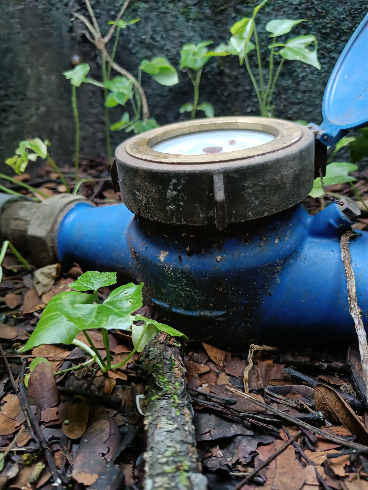
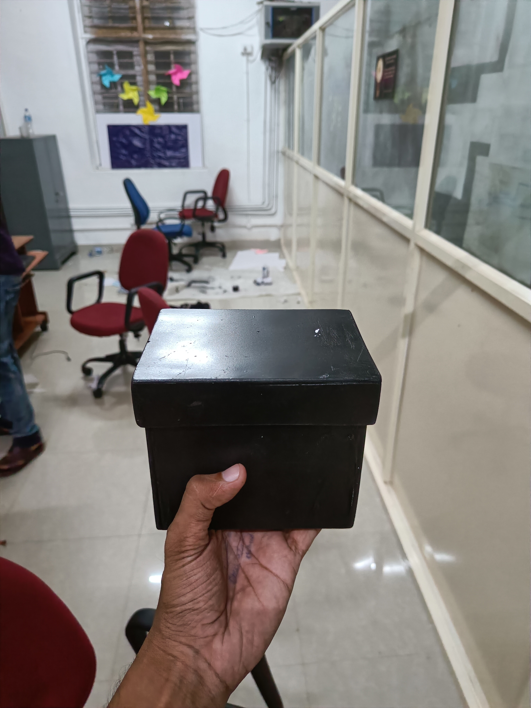
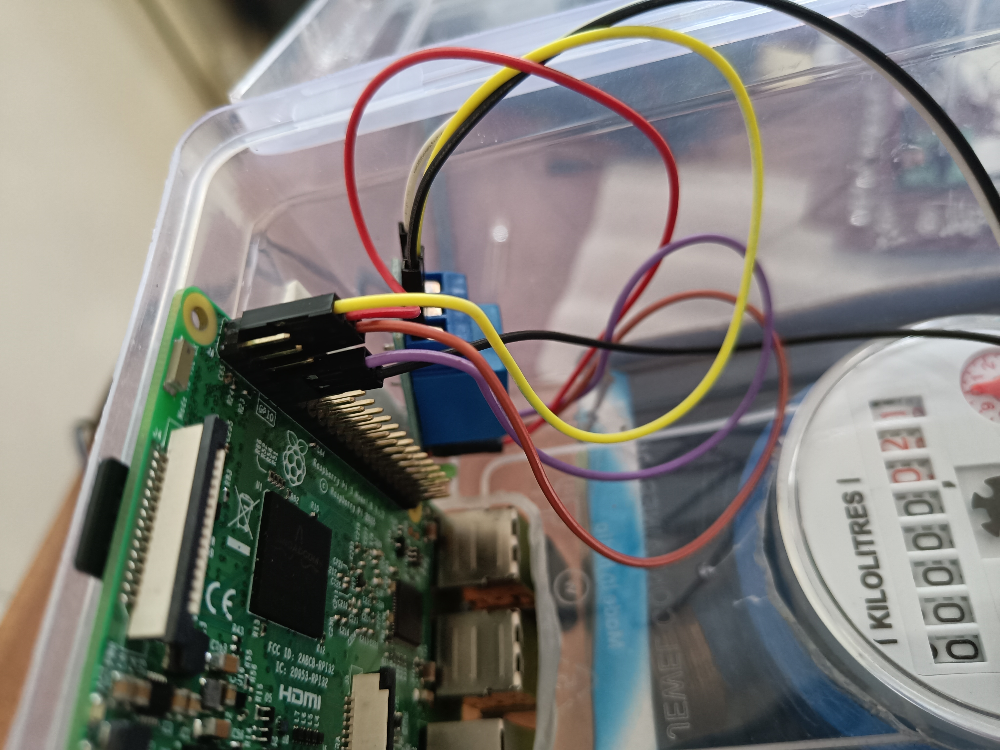
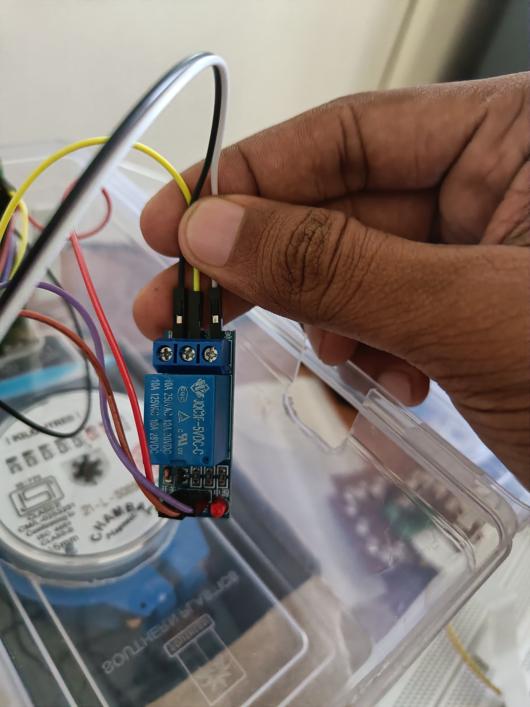

# IoT based consumption monitoring system for analog watermeters

The conventional method of manually reading analog meters to calculate a consumption trend is cumbersome and expensive. This approach is also incapable of effectively managing sustainable water supplies, as it needs accurate monitoring techniques that enable the consumers to know the level of water usage in real-time. The traditional analog water meters have a long life, and removing them for digitization is a waste of resources.
 
Although digital water meters are introduced in recent times and are used in workplaces like government institutions, hospitals, they are very expensive. Also, the digital water meter themselves do not give any inference or do not do any analytical analysis on the water consumption patterns. The project was implemented for conserving water in a better manner.

detailed **documentation** of the project can be found [here](https://drive.google.com/drive/folders/1e-ycQkM5Z1he4UFkH-HIAj8n3jgiuLwc?usp=sharing).

Different technologies used to build this project are :
 - RaspberryPi
 - Python
 - React
 - NodeJs
 - Amazon EC2
 - MySql
 - Machine learning

## Deployment

Click [me](https://lonebots.github.io/water-meter-project/) for the live demo of the web application (some of the functionalities may be unavailabe since the application is not connected to the database.)
## Features

- **for users**  
  - user login/logout - sessions
  - monitor water consumption
  - pay bill - addon
    -  view previous bills

- **for officials**
  - official login/logout - sessions
  - monitor overall consumption
  - add new user 
  - set the price slab for water unit 

### additional feature
  - support for malayam language

## License

[GNU Lesser General Public License v2.1](https://github.com/lonebots/water-meter-project/blob/main/LICENSE)

## Contributing

Contributions are always welcome!

See `contributing.md` for ways to get started.

Please adhere to this project's `code of conduct`.

## Project Team
- [Sooraj Bhaskaran](https://github.com/soorajbhskrn)
- [Ajay Ram K](https://github.com/ajayrmk)
- [Anirudh](https://github.com/Anirudhkv)
- [Jishnu Suresh](https://www.github.com/lonebots)

